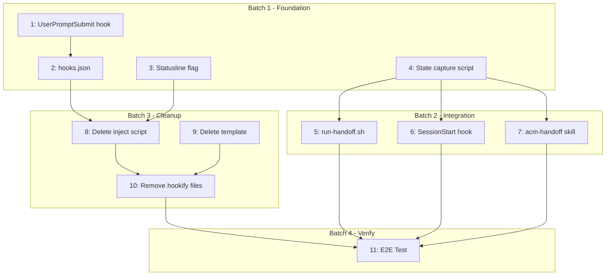

# Plan: Fix Handoff Trigger Mechanism

**Session ID:** plan-2026-01-18-1316
**Created:** 2026-01-18T13:16:03+00:00

## Problem Statement

The context handoff popup never appears because the hookify plugin's `warn` action only shows messages to the USER terminal, not to Claude's context. Claude never sees the instruction to ask about handoff.

## Scope & Boundaries

**IN SCOPE:**
- Replace hookify approach with native UserPromptSubmit hook
- Use same pattern as claudikins-kernel PreCompact (JSON with additionalContext)
- Replace prose summary with structured state (like kernel's preserve-state.sh)
- Update SessionStart hook to use structured state for precise resume
- Audit and verify entire handoff flow end-to-end
- Clean up obsolete hookify-related code

**OUT OF SCOPE:**
- Changes to statusline threshold detection (works correctly)
- Platform terminal detection improvements
- Multi-session management (one active handoff at a time)

## Success Criteria

1. When context reaches 60%, Claude asks "Generate handoff summary and start fresh?" via AskUserQuestion
2. User can select Yes/Snooze/Dismiss
3. On Yes: structured state saved, new terminal opens, state loads in new session
4. On Snooze: prompt reappears after 5 minutes
5. On Dismiss: no more prompts this session
6. New session resumes with precise context (current task, recent decisions, active todos)

## Approach

**Selected: Native hook + flag file pattern (same as kernel PreCompact)**

Statusline creates flag file when threshold reached. UserPromptSubmit hook checks for flag and injects additionalContext. Same proven pattern as kernel plugin.

## Tasks

<!-- EXECUTION_TASKS_START -->

| # | Task | Files | Deps | Batch |
|---|------|-------|------|-------|
| 1 | Create UserPromptSubmit hook script | hooks/scripts/user-prompt-submit.sh | - | 1 |
| 2 | Update hooks.json to register new hook | hooks/hooks.json | 1 | 1 |
| 3 | Simplify statusline to create flag file only | scripts/statusline-command.sh | - | 1 |
| 4 | Create structured state capture script | scripts/capture-state.sh | - | 1 |
| 5 | Rewrite run-handoff.sh to use structured state | scripts/run-handoff.sh | 4 | 2 |
| 6 | Update SessionStart hook for structured state | hooks/scripts/session-start.sh | 4 | 2 |
| 7 | Update acm-handoff skill for structured state | skills/acm-handoff/SKILL.md | 4 | 2 |
| 8 | Delete hookify injection script | scripts/inject-handoff-hook.sh | 2,3 | 3 |
| 9 | Delete hookify template | scripts/handoff-request-template.md | 2,3 | 3 |
| 10 | Clean up any existing hookify files | .claude/hookify.*.local.md | 8,9 | 3 |
| 11 | Test end-to-end handoff flow | - | all | 4 |

<!-- EXECUTION_TASKS_END -->

## Task Details

### Task 1: Create UserPromptSubmit hook script

Create `hooks/scripts/user-prompt-submit.sh`:

```bash
#!/bin/bash
# Claudikins ACM - UserPromptSubmit hook
# Checks for threshold flag and injects handoff prompt context

INPUT=$(cat)

# Extract session info (same pattern as kernel)
if command -v jq &>/dev/null; then
    SESSION_ID=$(echo "$INPUT" | jq -r '.session_id // empty')
else
    SESSION_ID=$(echo "$INPUT" | grep -o '"session_id":"[^"]*"' | sed 's/.*:"//;s/"//')
fi

[ -z "$SESSION_ID" ] && exit 0

# Load config
CONFIG="$HOME/.claude/claudikins-acm.conf"
[ -f "$CONFIG" ] && source "$CONFIG"
THRESHOLD="${THRESHOLD:-60}"
SNOOZE_DURATION="${SNOOZE_DURATION:-300}"

# Check flag files
FLAG_FILE="/tmp/acm-threshold-${SESSION_ID}"
SNOOZE_FILE="/tmp/acm-snooze-${SESSION_ID}"
DISMISSED_FILE="/tmp/acm-dismissed-${SESSION_ID}"
INPROGRESS_FILE="/tmp/acm-inprogress-${SESSION_ID}"

# Already dismissed this session?
[ -f "$DISMISSED_FILE" ] && exit 0

# Already handling a handoff request? (race condition prevention)
[ -f "$INPROGRESS_FILE" ] && exit 0

# Check snooze
if [ -f "$SNOOZE_FILE" ]; then
    snooze_until=$(cat "$SNOOZE_FILE")
    now=$(date +%s)
    [ "$now" -lt "$snooze_until" ] && exit 0
    rm -f "$SNOOZE_FILE"
fi

# No flag = no prompt needed
[ ! -f "$FLAG_FILE" ] && exit 0

# Read threshold % from flag file
PCT=$(cat "$FLAG_FILE" 2>/dev/null || echo "$THRESHOLD")

# Mark as in-progress to prevent race condition
INPROGRESS_FILE="/tmp/acm-inprogress-${SESSION_ID}"
touch "$INPROGRESS_FILE"

# Flag exists - inject context (same pattern as kernel execute-status.sh)
# Note: Timestamps calculated by Claude at runtime, not pre-evaluated here
cat <<EOF
{
  "hookSpecificOutput": {
    "hookEventName": "UserPromptSubmit",
    "additionalContext": "CONTEXT HANDOFF REQUIRED: Context usage at ${PCT}%. You MUST immediately use AskUserQuestion to ask the user:\\n\\nQuestion: 'Context at ${PCT}%. Generate handoff summary and start fresh?'\\nHeader: 'Handoff'\\nOptions:\\n  - 'Yes, handoff now' (Generate summary and open new session)\\n  - 'Snooze 5 min' (Ask again in 5 minutes)\\n  - 'Dismiss' (Don't ask again this session)\\n\\nAfter user responds, run these Bash commands:\\n- YES: bash \${CLAUDE_PLUGIN_ROOT}/scripts/run-handoff.sh && rm -f /tmp/acm-threshold-${SESSION_ID} /tmp/acm-inprogress-${SESSION_ID}\\n- SNOOZE: echo \\\"\$((\$(date +%s) + ${SNOOZE_DURATION}))\\\" > /tmp/acm-snooze-${SESSION_ID} && rm -f /tmp/acm-threshold-${SESSION_ID} /tmp/acm-inprogress-${SESSION_ID}\\n- DISMISS: touch /tmp/acm-dismissed-${SESSION_ID} && rm -f /tmp/acm-threshold-${SESSION_ID} /tmp/acm-inprogress-${SESSION_ID}\\n\\nThen proceed with the user's original prompt."
  }
}
EOF

exit 0
```

### Task 2: Update hooks.json

Add UserPromptSubmit hook to `hooks/hooks.json`:

```json
{
  "hooks": {
    "SessionStart": [...existing...],
    "UserPromptSubmit": [
      {
        "matcher": "",
        "hooks": [
          {
            "type": "command",
            "command": "bash ${CLAUDE_PLUGIN_ROOT}/hooks/scripts/user-prompt-submit.sh",
            "timeout": 5
          }
        ]
      }
    ]
  }
}
```

### Task 3: Simplify statusline threshold trigger

In `scripts/statusline-command.sh`, replace the hookify injection (lines ~110-116) with simple flag file creation:

```bash
# Instead of inject-handoff-hook.sh, just create flag file
echo "$pct" > "/tmp/acm-threshold-${session_id}"
```

### Task 4: Create structured state capture script

Create `scripts/capture-state.sh` - extracts structured state from current session:

```bash
#!/bin/bash
# Claudikins ACM - Capture structured state for handoff
# Mirrors kernel's preserve-state.sh pattern

PROJECT_DIR="${1:-.}"
TRANSCRIPT="${2:-}"
OUTPUT_FILE="$PROJECT_DIR/.claude/claudikins-acm/handoff-state.json"

mkdir -p "$(dirname "$OUTPUT_FILE")"

# Find transcript if not provided
if [ -z "$TRANSCRIPT" ]; then
    TRANSCRIPT=$(find ~/.claude/projects -name "*.jsonl" -type f -printf '%T@ %p\n' 2>/dev/null | sort -n | tail -1 | cut -d' ' -f2-)
fi

# Extract structured state
python3 << 'PYEOF'
import json
import sys
import os
from datetime import datetime

transcript_path = os.environ.get('TRANSCRIPT', '')
output_path = os.environ.get('OUTPUT_FILE', '')
project_dir = os.environ.get('PROJECT_DIR', '.')

state = {
    "version": "2.0",
    "created_at": datetime.now().isoformat(),
    "project_dir": os.path.abspath(project_dir),
    "transcript_path": transcript_path,
    "context": {
        "current_objective": "",
        "progress_summary": [],
        "active_todos": [],
        "recent_decisions": [],
        "key_files_modified": [],
        "next_steps": []
    }
}

# Parse transcript for context
if transcript_path and os.path.exists(transcript_path):
    todos = []
    decisions = []
    files_modified = set()
    recent_messages = []

    with open(transcript_path, 'r') as f:
        for line in f:
            try:
                entry = json.loads(line)
                msg_type = entry.get('type', '')

                # Track todos
                if msg_type == 'tool_use' and entry.get('tool_name') == 'TodoWrite':
                    todo_input = entry.get('tool_input', {})
                    if 'todos' in todo_input:
                        todos = todo_input['todos']

                # Track file modifications
                if msg_type == 'tool_use' and entry.get('tool_name') in ['Write', 'Edit']:
                    fp = entry.get('tool_input', {}).get('file_path', '')
                    if fp:
                        files_modified.add(fp)

                # Track recent conversation
                if msg_type in ('user', 'assistant'):
                    content = entry.get('message', {}).get('content', '')
                    if isinstance(content, list):
                        content = ' '.join([c.get('text', '') for c in content if isinstance(c, dict)])
                    if content:
                        recent_messages.append({
                            'role': msg_type,
                            'content': content[:500]  # Truncate long messages
                        })
                        recent_messages = recent_messages[-10:]  # Keep last 10

            except json.JSONDecodeError:
                continue

    # Extract current objective from first user message
    if recent_messages:
        for msg in recent_messages:
            if msg['role'] == 'user':
                state['context']['current_objective'] = msg['content'][:200]
                break

    # Active todos
    state['context']['active_todos'] = [
        t for t in todos if t.get('status') in ('pending', 'in_progress')
    ]

    # Files modified
    state['context']['key_files_modified'] = list(files_modified)[-10:]

# Git context
try:
    import subprocess
    branch = subprocess.check_output(['git', 'branch', '--show-current'],
                                     cwd=project_dir, stderr=subprocess.DEVNULL).decode().strip()
    state['git'] = {'branch': branch}

    status = subprocess.check_output(['git', 'status', '--short'],
                                     cwd=project_dir, stderr=subprocess.DEVNULL).decode().strip()
    state['git']['modified_files'] = status.split('\n')[:5] if status else []
except:
    pass

# Write output
with open(output_path, 'w') as f:
    json.dump(state, f, indent=2)

print(f"State captured to {output_path}")
PYEOF

echo "$OUTPUT_FILE"
```

### Task 5: Rewrite run-handoff.sh to use structured state

Replace prose summary generation with structured state capture:

```bash
# In run-handoff.sh, replace the SUMMARY generation section with:

# Capture structured state instead of prose summary
STATE_FILE=$("$SCRIPT_DIR/capture-state.sh" "$(pwd)" "$TRANSCRIPT")

# Also generate a human-readable version
cat > "$HANDOFF_DIR/handoff.md" << EOF
# Claudikins ACM Handoff

*Generated: $(date)*

## Current Objective
$(jq -r '.context.current_objective // "Not captured"' "$STATE_FILE")

## Active Todos
$(jq -r '.context.active_todos[] | "- [\(.status)] \(.content)"' "$STATE_FILE" 2>/dev/null || echo "None")

## Recent Files Modified
$(jq -r '.context.key_files_modified[]' "$STATE_FILE" 2>/dev/null | head -5 || echo "None")

## Git Status
Branch: $(jq -r '.git.branch // "unknown"' "$STATE_FILE")

---
*Full state: .claude/claudikins-acm/handoff-state.json*
EOF
```

### Task 6: Update SessionStart hook for structured state

Update `hooks/scripts/session-start.sh` to load structured state:

```bash
# Add after existing handoff check:
STATE_FILE=".claude/claudikins-acm/handoff-state.json"

if [ -f "$STATE_FILE" ]; then
    # Load structured state for precise resume
    CONTEXT=$(python3 << 'PYEOF'
import json
import sys

with open('.claude/claudikins-acm/handoff-state.json') as f:
    state = json.load(f)

ctx = state.get('context', {})
lines = []

if ctx.get('current_objective'):
    lines.append(f"PREVIOUS OBJECTIVE: {ctx['current_objective']}")

if ctx.get('active_todos'):
    lines.append("ACTIVE TODOS:")
    for t in ctx['active_todos']:
        lines.append(f"  - [{t.get('status', 'pending')}] {t.get('content', '')}")

if ctx.get('key_files_modified'):
    lines.append(f"RECENTLY MODIFIED: {', '.join(ctx['key_files_modified'][:5])}")

print('\n'.join(lines))
PYEOF
)
fi
```

### Task 7: Update acm-handoff skill for structured state

Update skill to read and present structured state clearly.

### Task 8-9: Delete obsolete files

- `scripts/inject-handoff-hook.sh`
- `scripts/handoff-request-template.md`

### Task 10: Cleanup existing hookify files

```bash
rm -f .claude/hookify.handoff-request.local.md
```

### Task 11: End-to-end test

1. Start fresh Claude session
2. Create some todos, modify some files
3. Work until context reaches 60%
4. Verify AskUserQuestion popup appears
5. Select "Yes, handoff now"
6. Verify structured state captured correctly
7. Verify new session loads with correct context
8. Test Snooze and Dismiss options

## Dependencies



## Risks & Mitigations

*Reviewed by Klaus - concerns addressed:*
- *UserPromptSubmit additionalContext: verified by kernel's execute-status.sh*
- *Snooze timestamp: now calculated at runtime by Claude*
- *Race condition: prevented by in-progress flag*

| Risk | Likelihood | Impact | Mitigation |
|------|------------|--------|------------|
| additionalContext not reaching Claude | Low | High | Pattern proven by kernel execute-status.sh |
| Flag file race conditions | Low | Medium | Use atomic operations, session-scoped files |
| User never sees popup | Medium | High | Add logging, test thoroughly |
| Hook timeout too short | Low | Medium | Set generous timeout (5s) |
| Transcript parsing fails | Medium | Medium | Graceful degradation - capture what we can |
| Python not available | Low | High | Fall back to shell-only extraction |
| State file corruption | Low | Medium | Validate JSON before loading |

## Verification Checklist

### Hook Mechanism
- [ ] UserPromptSubmit hook script exists and is executable
- [ ] hooks.json valid JSON and includes UserPromptSubmit
- [ ] Statusline creates flag file at threshold
- [ ] Flag file contains percentage value
- [ ] Hook reads flag and outputs additionalContext JSON
- [ ] Claude displays AskUserQuestion when additionalContext injected

### User Responses
- [ ] Yes response triggers run-handoff.sh
- [ ] Snooze response creates snooze file with future timestamp
- [ ] Dismiss response creates dismissed file

### Structured State
- [ ] capture-state.sh extracts todos from transcript
- [ ] capture-state.sh extracts modified files
- [ ] capture-state.sh captures git context
- [ ] handoff-state.json created with valid structure
- [ ] handoff.md generated as human-readable summary

### Session Resume
- [ ] SessionStart hook detects handoff state
- [ ] Structured context loaded into new session
- [ ] Active todos restored
- [ ] acm-handoff skill presents state clearly

### Cleanup
- [ ] All obsolete hookify files removed
- [ ] inject-handoff-hook.sh deleted
- [ ] handoff-request-template.md deleted
