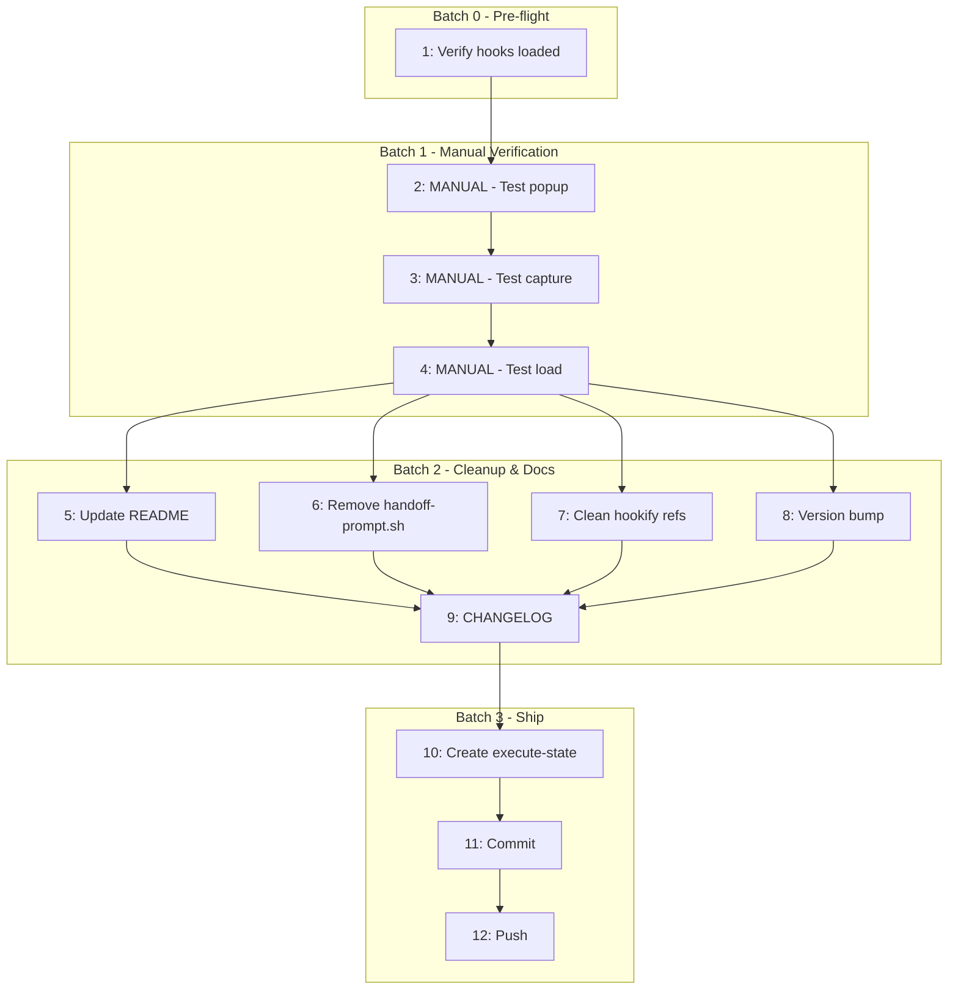

# Plan: Verify and Ship Native Hooks Implementation

**Session ID:** plan-2026-01-18-1821
**Created:** 2026-01-18T18:21:52+00:00
**Approach:** A - Verify First
**Reviewed by:** Klaus (iteration 1)

## Problem Statement

Native hooks implementation for context handoff exists on main (10 commits, LOCAL ONLY) but was merged via manual/cowboy workflow that bypassed:

- Proper execution state tracking
- Version bump (still at 1.0.0)
- CHANGELOG creation
- Verification gate
- README documentation update

Code needs to be verified as working, versioned, documented, and shipped properly.

## Scope & Boundaries

**IN SCOPE:**

- Manual E2E verification of handoff flow (human must click and observe)
- Fix bugs found during verification
- Version bump to 1.1.0
- Create CHANGELOG.md (Keep a Changelog format)
- Update plugin.json
- Update README.md to remove hookify references
- Remove handoff-prompt.sh (legacy Windows script)
- Clean up remaining hookify references in code
- Create proper execute-state.json for gate compliance
- Push to origin and trigger marketplace update

**OUT OF SCOPE:**

- Code polish/refactoring (cynic pass)
- New features
- Fixing the triple-quote edge case (noted as known issue)
- platforms/ scripts (keep as-is for cross-platform support)

## Success Criteria

1. **E2E Flow Works (manually verified):**
   - Flag file creation triggers popup
   - AskUserQuestion appears with 3 options
   - "Yes" triggers state capture
   - New session loads state correctly

2. **Documentation Updated:**
   - README.md reflects native hooks (no hookify mentions)
   - CHANGELOG.md documents all changes
   - plugin.json version = 1.1.0

3. **Cleanup Complete:**
   - handoff-prompt.sh removed
   - No hookify references in code
   - Legacy files deleted

4. **Gate Compliance:**
   - execute-state.json exists with status "completed"
   - All commits pushed to origin

## Tasks

<!-- EXECUTION_TASKS_START -->

| #   | Task                                                      | Files                      | Deps    | Batch |
| --- | --------------------------------------------------------- | -------------------------- | ------- | ----- |
| 1   | Pre-flight: verify hooks.json loaded and skill registered | -                          | -       | 0     |
| 2   | MANUAL: Create flag file and verify popup appears         | -                          | 1       | 1     |
| 3   | MANUAL: Select "Yes" and verify state capture             | -                          | 2       | 1     |
| 4   | MANUAL: Start new session and verify state loads          | -                          | 3       | 1     |
| 5   | Update README.md to remove hookify references             | README.md                  | 4       | 2     |
| 6   | Remove legacy handoff-prompt.sh                           | scripts/handoff-prompt.sh  | 4       | 2     |
| 7   | Clean hookify ref from run-handoff.sh line 61             | scripts/run-handoff.sh     | 4       | 2     |
| 8   | Bump version to 1.1.0                                     | .claude-plugin/plugin.json | 4       | 2     |
| 9   | Create CHANGELOG.md with 1.1.0 entry                      | CHANGELOG.md               | 5,6,7,8 | 2     |
| 10  | Create execute-state.json for gate                        | .claude/execute-state.json | 9       | 3     |
| 11  | Commit all changes                                        | -                          | 10      | 3     |
| 12  | Push to origin                                            | -                          | 11      | 3     |

<!-- EXECUTION_TASKS_END -->

## Manual Verification Protocol (Batch 1)

**These are HUMAN steps, not automated tests.**

### Step 2: Test Popup Appears

```bash
# Get your current session ID from Claude's status
SESSION_ID="your-session-id"

# Create the threshold flag file
echo "65" > "/tmp/acm-threshold-${SESSION_ID}"

# Now send any prompt to Claude
# OBSERVE: Does AskUserQuestion appear with "Context at 65%..." message?
```

**Pass:** Popup appears with 3 options (Yes/Snooze/Dismiss)
**Fail:** No popup, or wrong content

### Step 3: Test State Capture

```bash
# Click "Yes, handoff now" in the popup
# OBSERVE: Does Claude run the handoff script?

# Check state was captured:
cat .claude/claudikins-acm/handoff-state.json
cat .claude/claudikins-acm/handoff.md
```

**Pass:** Both files exist with correct content
**Fail:** Files missing or malformed

### Step 4: Test Session Load

```bash
# Open a NEW terminal
# Run: claude
# OBSERVE: Does Claude immediately mention the handoff?
# OBSERVE: Does it invoke /acm:handoff skill?
```

**Pass:** New session acknowledges previous context
**Fail:** New session starts fresh with no handoff awareness

**GATE: If ANY step fails, STOP and debug before proceeding to Batch 2.**

## Dependencies



## Risks & Mitigations

| Risk                                    | Likelihood | Impact | Mitigation                              |
| --------------------------------------- | ---------- | ------ | --------------------------------------- |
| Manual verification reveals broken flow | Medium     | High   | Fix bugs before Batch 2; DO NOT proceed |
| Can't get session ID for flag file      | Low        | Medium | Check Claude logs or use wildcard       |
| README update misses hookify refs       | Low        | Medium | Grep for "hookify" before committing    |
| Marketplace doesn't auto-update         | Low        | Medium | Check plugin.json format matches spec   |

**Known Issues (Won't Fix This Release):**

- session-start.sh Python triple-quote interpolation could fail if context contains `'''`

## Verification Checklist

### Pre-flight

- [ ] hooks.json loaded by Claude (check settings or logs)
- [ ] /acm:handoff skill is registered

### E2E Flow (Manual)

- [ ] Flag file triggers popup
- [ ] Popup has correct options
- [ ] "Yes" creates handoff-state.json
- [ ] "Yes" creates handoff.md
- [ ] New session detects handoff
- [ ] /acm:handoff presents context

### Documentation & Cleanup

- [ ] README.md has no hookify references (grep -r hookify README.md returns nothing)
- [ ] handoff-prompt.sh deleted
- [ ] run-handoff.sh line 61 hookify cleanup removed
- [ ] plugin.json version = 1.1.0
- [ ] CHANGELOG.md exists with 1.1.0 entry

### Ship

- [ ] execute-state.json exists with status "completed"
- [ ] All changes committed
- [ ] Pushed to origin
- [ ] Verify marketplace reflects update (may take time)

## Rollback Plan

If manual verification fails badly:

1. Do NOT proceed to Batch 2
2. Identify the specific failure point
3. Debug and fix on main (it's local only anyway)
4. Re-run verification from Step 2
5. If 3+ iterations fail, consider reverting commits and starting fresh
